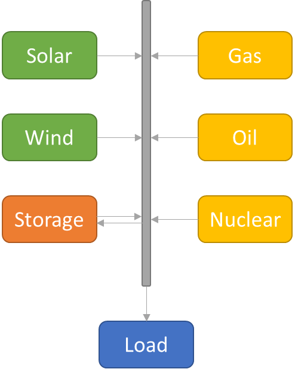

# EESREP

EESREP is a component based energy system optimisation python module.

EESREP allows setting-up an energy system using its API, parametrising its components, and optimize it using a time rolling horizon. The models generated by EESREP are based on the MILP format (see section Tutorials).

The following images an energy system example that can be done using EESREP.

<!-- <p align="center">

</p> -->


EESREP is a research tool developed at CEA (DES/ISAS/DM2S/SERMA).

##   Install

EESREP works on python3 (tested between 3.6 and 3.11) and can be installed using the command:

```
python -m pip install eesrep
```

EESREP allows using several distinct MILP modeler module, none is installed with the module to let the user decide which one use. The built-in version of EESREP allows using the following modules:

- **mip** : Allows using the CBC solver installed with it. The CBC solver installation can however present some difficulties on linux or without the proper compiling tools (more information can be found at https://python-mip.readthedocs.io/en/latest/install.html);
- **docplex** : Official CPLEX modeling module (see https://pypi.org/project/docplex/). CPLEX solver has to be installed aside of it (solver only free for students or with a maximum of 1000 variables and constraints, ***pip install cplex*** or see https://www.ibm.com/fr-fr/products/ilog-cplex-optimization-studio) ;
- **pyomo** : Interfaces with several solvers that have to be installed aside of it (see installation instructions at https://pyomo.readthedocs.io/en/stable/installation.html).

When installed using pip, EESREP will comme with the following packages and their respective pre-requisites:
- **numpy**
- **pandas**
- **matplotlib**

In order not create conflicts in your current python environment, it is possible to create a virtual environment from which work. For more informations, see https://docs.python.org/3/library/venv.html.

##   Tutorials

Several jupyter notebook are present in the folder tutorials to explain how to build a energy system MILP model, and how to use EESREP. They are sorted in different categories:

-   **MILP_i** : explains how a MILP works and and how to set-up one;
-   **Use_i** : Explains how to use the module EESREP;
-   **Dev_i** : Explains how to create and use a custom component with EESREP.

More example can be found in the EESREP installation folder:
- AEN : Two linked countries electric mix model (folder use_cases/AEN);
- Components test base (folder tests/tests_theory).

##   Documentation

The Sphinx generated documentation of the module can be found at this adress:

https://readthedocs.org/projects/eesrep/

##   Q&A

-   EESREP, what for ?
    -   EESREP is a python energy system optimisation module. It helps the user setting-up a system model by simply plugging components to each others, and interfacing this model to a python MILP modeler module.


-   Which MILP solver use ?
	-   Some elements on MILP solving algorithm and solvers are given there : https://developers.google.com/optimization/lp/lp_advanced?hl=en

-   I'm a beginner, how do i use EESREP?
	-   See the section installation for more information, if you are starting from scratch on a windows computer, we recommend using the **mip** python module. See the tutorials in the docs for more informations about how EESREP works.
    
-   What are the built-in components?
    -   **Converter** : Returns its input multiplied to an efficiency;
    -   **Cluster** : Aggregates several converters allowing to turn them on and off;
    -   **Dam** : Water dam with storage, pumping, several input and outputs;
    -   **Source** : Provides an optimized amount of energy;
    -   **Sink** : Takes out an optimized amount of energy from the system;
    -   **Fatal_source** : Provides a pre-determined amount of energy;
    -   **Fatal_sink** : Takes out a pre-determined amount of energy from the system;
    -   **GenericStorage** : Stores and returns energy to the system, applying a loss;
    -   **Delayer** : Output is delayed with regard to the input;
    -   **Integral** : Sums the input on several time steps;
    -   **Lower_than** : Sets its input lower than a value or time serie;
    -   **Greater_than** : Sets its input greater than a value or time serie.
    
-   Can i get direct support? Please send an email to the adress: support-eesrep@cea.fr

-   How to set up my rolling horizon?
	-   You want the rolling horizon to be as wide as you want the time prediction of the model to be. So if you have a weekly storage, we can expect a **future_size** of on week to be enough;
	-   If the **future_size** variable equals the **time_shift**, there will be no overlap between two horizons. If the time_shift is smaller, the last time steps will be recalculated, allowing smoother transitions.

-   MILP model, tips & tricks :
	-   Avoid strict constraints : 
		-   A very expensive source and sink can make the problem much easier to solve at no cost;
		-   Boundaries can be replaced by an expensive cost for every unit beyond this boundray, which can significantly improve the solving time.
	-   Avoid identical components/variable: Making the solver decide between two identical means can increase the solving time, give random looking solutions, and can change from a solve to the next. This can be prevented by adding a negligible different price to each identical component.


##   Help improving EESREP!

###  You want to share a component?

User made components can be added to the user_components folder. For this, make a serie of tests that validates the component behavior based on theoretical unique solution problems. Then make a pull request on the git repository.

###  You want to improve EESREP core?

Few elements to know:
-   After coding your modification, run the test base present in the folder tests: All tests should be valid. Each added features shall be entirely tested with unit tests as done in the folder tests/tests_unit;

-   No python modeler shall be called directly, we always need to go throught a GenericInterface. If a modification of API is done on an interface, it has to be implemented to all built-in interfaces;

-   When everything is valid, please send a pull request.